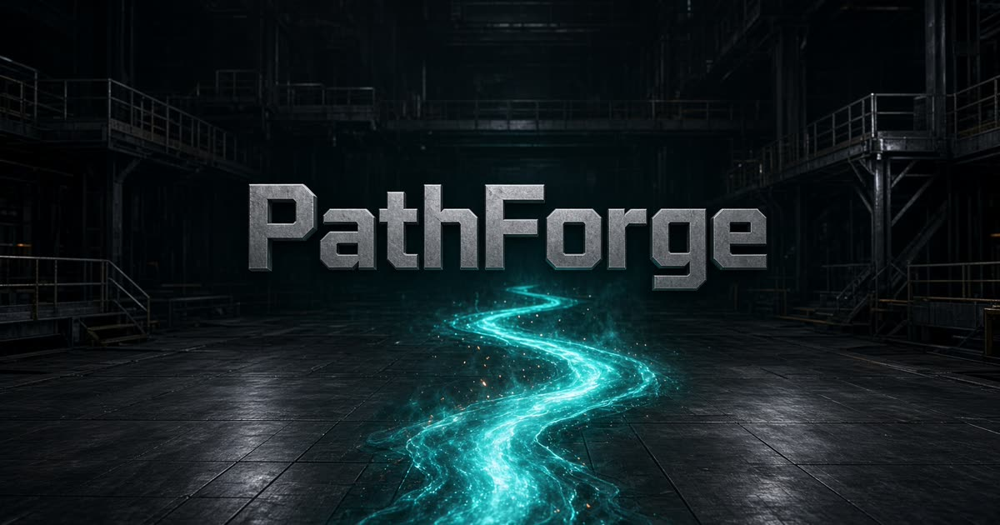

# PathForge

CNC toolpath simulator in the browser. Paste G-code, scrub the program, and watch the cutter in 3D.



## What it does

- Parses **G0 / G1 / G2 / G3** (IJK and R arcs), **G17–G19**, **G20/G21**, **G90/G91**, feed, spindle
- Timed playback with DRO (X Y Z), line seek, and speed control
- Sample programs: square pocket, helical bore, contour, facing, spiral
- Three.js mill: stock, T-slot table, cutter, feed vs rapid coloring

## Run locally

Needs [Node.js 22+](https://nodejs.org/).

```bash
npm install
npm run dev
```

Open http://localhost:5173

```bash
npm run build
npm run preview
```

## Stack

React 19 · TanStack Start · Three.js (R3F) · Zustand · Tailwind v4

G-code engine is in `src/lib/gcode/` — no CAM library, the interpolator is handwritten.

## Deploy

Import the repo on [Vercel](https://vercel.com/new). Build command: `npm run build`.

## License

MIT
